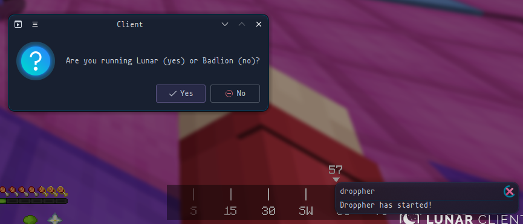
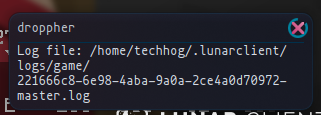
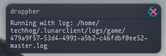
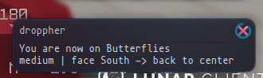

# Droppher

An assistant for Hypixel dropper
<br>
Droppher provides live notifications displaying information about maps.






## Todo

- [x] Notification on match start & map completion
- [x] Lunar support
- [x] Windows support
- [x] Spanish support
- [x] English support
- [ ] Badlion support
    - [x] Badlion for Windows
    - [ ] Badlion for Linux
- [ ] Map information
    - [x] Name
    - [ ] Direction to face & how to move

## Known bugs

None (yet) :D

## Download

The following platforms are supported:
<br>
- [Windows](https://github.com/TechHog8984/droppher/releases/download/v1.1.0/droppher.exe)
- [Linux](https://github.com/TechHog8984/droppher/releases/download/v1.1.0/droppher)

## Building

```sh
cargo build --release
```

## Usage

Run in terminal (sorry)

## Contributing

If you want to contribute [code](src/main.rs) or [map information](assets/map_information.json), submit a pull request!
<br>
If you want to contribute language support or if you need help with pull requests, reach out to me on discord @techhog

## Bugs

Find a bug? [Report an issue](https://github.com/TechHog8984/droppher/issues/new/choose).