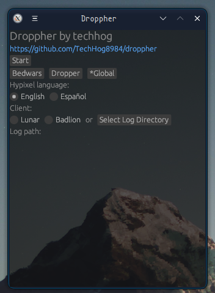

# Droppher

An assistant for Hypixel dropper
<br>
Droppher provides live notifications, displaying information about maps (eventually).




## Todo

- [x] Notification on match start & map completion
- [x] Lunar support
- [x] Windows support
- [ ] Badlion support
    - [x] Badlion for Windows
    - [ ] Badlion for Linux
- [ ] Map information
    - [x] Name
    - [ ] Direction to face & how to move
- [ ] Language support
    - [ ] English

## Known bugs

Droppher is known to skip messages

## Download

The following platforms are supported:
<br>
- [Windows](https://github.com/TechHog8984/droppher/releases/download/v0.2.1/droppher.exe)
- [Linux](https://github.com/TechHog8984/droppher/releases/download/v0.2.1/droppher)

## Building

```sh
cargo build --release
```

## Usage

Run in terminal (sorry)