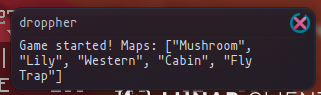
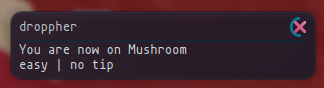

# Droppher

An assistant for Hypixel dropper.
Droppher provides live notifications, providing information you may forget about maps






## Todo

- [x] Notification on match start & map completion
- [x] Lunar support
- [ ] Map information
- [ ] Badlion support

## Known bugs

Droppher is known to skip messages

## Download

The following platforms are supported:
<br>
- [Windows](https://github.com/TechHog8984/droppher/releases/download/v0.1.1/droppher.exe) (NOT TESTED PLEASE TEST THIS AND LMK HOW IT GOES)
- [Linux](https://github.com/TechHog8984/droppher/releases/download/v0.1.1/droppher)

## Building

```sh
cargo build --release
```

## Usage

Run in terminal (sorry)